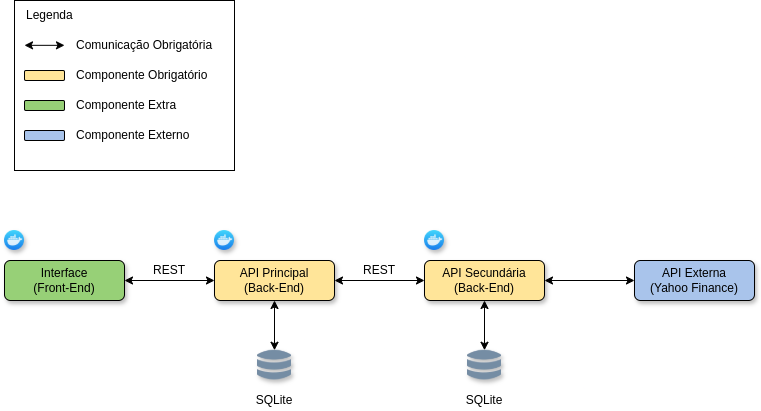

# 🌱 API Principal
  
  
  


A API Principal é um serviço desenvolvido em FastAPI que gerencia usuários, salários e metas de economia.
Ela permite o cadastro e gerenciamento de usuários, bem como a criação e consulta de metas (goals), 
realizando integração direta com a API Secundária para o gerenciamento completo das metas de economia.
---

## 🚀 Funcionalidades

- Criar, excluir e recuperar informações de usuário;
- Atualizar nome de usuário e salário;
- Criar, visualizar, atualizar e excluir metas de economia;
- Comunicação com API secundária para gestão das metas.

---

## ⚙️ Instalação e Configuração

### 1. Clone o repositório:
```bash
git clone https://github.com/yoko-takano/mvp-login-api.git
cd mvp-login-api
```

### 2. Crie e ative um ambiente virtual:

```bash
python -m venv venv
source venv/bin/activate
```

### 3. Instale as dependências:

```bash
pip install -r requirements.txt
```

### 4. Inicie a aplicação usando Docker:

Certifique-se de que a network `app-network` já existe em seu ambiente Docker com o comando:

```bash
docker network ls
```

Ou crie-a com:

E em seguida suba o container:
```bash
docker-compose up --build
```

A API estará disponível em `http://localhost:5001`.

---

## 📌 Arquitetura da Aplicação

### 🎯 Fluxograma
Fluxograma ilustrando a arquitetura da aplicação desenvolvida.



### 📚 Rotas da API Principal

As rotas abaixo compõem as funcionalidades de gerenciamento de usuários e suas metas de economia:

**`POST` /users** - Cria um novo usuário  
**`GET` /users/{username}** - Retorna os dados do usuário e as metas criadas por aquele usuário
**`DELETE` /users/{username}** - Deleta os dados do usuário
**`PUT` /users/{username}/username** - Atualiza username do usuário
**`PUT` /users/{username}/salary** - Atualiza salário do usuário

As rotas a seguir interagem diretamente com a API Secundária para o gerenciamento das metas de economia:

**`POST` /users/{username}/goal** - Cria uma meta de economia  
**`GET` /users/{username}/goal/{goal_id}** - Retorna uma meta específica por ID  
**`PUT` /users/{username}/goal/{goal_id}** - Atualiza uma meta existente  
**`DELETE` /users/{username}/goal/{goal_id}** - Remove uma meta do banco de dados  

> Todas as rotas possuem documentação com anotações OpenAPI3.

## 🌍 API Externa: Yahoo Finance (yfinance)

Para realizar a conversão de moedas das metas (goals), a API Secundária utiliza a biblioteca yfinance, 
que fornece acesso aos dados financeiros disponibilizados pelo Yahoo Finance.

### 📄 Licença de uso

A biblioteca yfinance é de uso livre sob licença Apache 2.0.
Não é necessário realizar cadastro para utilizar os dados públicos disponibilizados.

### 💱 Exemplo de uso
A conversão de moedas é feita com o código da moeda no formato de par cambial:

```
pair = "USDBRL=X"
exchange_rate = YahooFinanceService.get_exchange_rate(pair)
```
